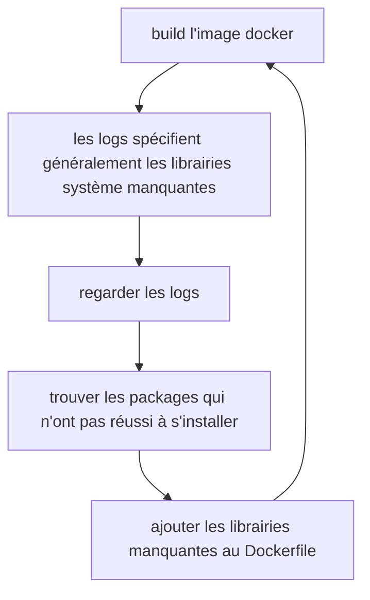

# Tutoriel : déploiement d'une application Shiny sur le SSP Cloud

## Sommaire

- [Tutoriel : déploiement d'une application Shiny sur le SSP Cloud](#tutoriel---d-ploiement-d-une-application-shiny-sur-le-ssp-cloud)
  * [Sommaire](#sommaire)
  * [Contexte](#contexte)
  * [Environnement](#environnement)
  * [Développement de l'application](#d-veloppement-de-l-application)
    + [Mettre les données d'entrée sur MinIO](#mettre-les-donn-es-d-entr-e-sur-minio)
    + [Phase de développement en self](#phase-de-d-veloppement-en-self)
    + [Packaging](#packaging)
    + [Conteneurisation](#conteneurisation)
    + [Intégration continue (CI)](#int-gration-continue--ci-)
  * [Déploiement de l'application](#d-ploiement-de-l-application)
    + [Création d'un Chart Helm](#cr-ation-d-un-chart-helm)
    + [Utilisation du stockage de données S3 avec MinIO](#utilisation-du-stockage-de-donn-es-s3-avec-minio)
    + [Utilisation d'une base de données PostgreSQL](#utilisation-d-une-base-de-donn-es-postgresql)
    + [Déploiement du chart Helm](#d-ploiement-du-chart-helm)
  * [*Debugging*/maintenance de l'application](#-debugging--maintenance-de-l-application)
    + [Commandes de *debugging*](#commandes-de--debugging-)
    + [Procédure de *debugging*](#proc-dure-de--debugging-)
  * [Pour aller plus loin](#pour-aller-plus-loin)
    + [ShinyProxy](#shinyproxy)

## Contexte

Ce tutoriel documente le processus de déploiement d'une application web interactive sur le [SSP Cloud](https://datalab.sspcloud.fr/home). La procédure est illustrée à travers l'exemple du déploiement d'une [application R Shiny](https://shiny.rstudio.com/). On utilise deux dépôts GitHub qui font office de *templates* :
- un [premier dépôt](https://github.com/InseeFrLab/template-shiny-app) contenant le code source d'une application Shiny illustrative ;
- un [second dépôt](https://github.com/InseeFrLab/template-shiny-deployment) contenant les fichiers de configuration du déploiement de l'application.

En pratique, ce tutoriel peut être facilement adapté pour déployer des applications web interactives utilisant des *fameworks* différents, comme [Flask](https://flask.palletsprojects.com/en/2.2.x/) ou [Streamlit](https://streamlit.io/) en `Python` par exemple.

## Environnement

Le déploiement de l'application est effectué sur le [SSP Cloud](https://datalab.sspcloud.fr/home), une instance du projet [Onyxia](https://github.com/InseeFrLab/onyxia) hébergée à l'Insee. Cette instance est basée sur un [cluster Kubernetes](https://kubernetes.io/fr/docs/concepts/overview/what-is-kubernetes/). Fondamentalement, le déploiement des ressources de l'application sera donc effectué sur Kubernetes. Il est donc nécessaire de pouvoir communiquer avec le *cluster* afin de procéder au déploiement.

Pour cela, on se placera dans le terminal d'un service VSCode, lancé à partir du [SSP Cloud](https://datalab.sspcloud.fr/home). Précision importante : pour pouvoir déployer des ressources sur le cluster Kubernetes, il est nécessaire de lancer le service VSCode en *spécifiant des droits Admin sur son namespace Kubernetes* (à l'initialisation du service dans l'IHM : onglet Kubernetes -> "Role" -> sélectionner "admin"). Ce [tutoriel](https://github.com/InseeFrLab/sspcloud-tutorials/blob/main/vscode-github/vscode-github.md) illustre en détail la prise en main et l'utilisation du service VSCode, ainsi que son interfaçage avec Git et GitHub.

## Développement de l'application

### Mettre les données d'entrée sur MinIO

La première étape du processus de déploiement consiste à stocker les données d'entrée de manière à les rendre accessibles à partir du cluster. Les données peuvent être mises sur votre bucket personnel, ou bien sur un bucket partagé en cas de projet collaboratif. 

La méthode la plus simple est d'uploader les données à partir d'une interface graphique, que ce soit celle (en cours de développement) du [Datalab](https://datalab.sspcloud.fr/mes-fichiers) ou bien directement la [console MinIO](https://minio-console.lab.sspcloud.fr/buckets). Il est également possible d'interagir avec MinIO en R (RStudio), Python (JupyterLab ou VSCode), ou dans un terminal avec le client [mc](https://docs.min.io/docs/minio-client-complete-guide.html). La [documentation](https://docs.sspcloud.fr/onyxia-guide/stockage-de-donnees) du projet Onyxia détaille ces différentes méthodes.

### Phase de développement en self

Le développement d'une application Shiny commence généralement en self, que ce soit sur poste ou sur un environnement de calcul dédié. En général, cet environnement est différent de celui sur lequel l'application va être déployée. Par exemple, il est fréquent de développer son application sur son poste de travail, donc avec Windows, là où les serveurs utilisent généralement Linux.

Ces différences entre les environnements de développement et de production vont nécessiter des ajustements au moment du déploiement, qui peuvent être substantiels. Afin de limiter ce risque, il est conseillé de commencer à développer le plus tôt possible sur un environnement proche de celui de production. Par exemple, sur le SSP Cloud, cela peut consister à développer dans un service RStudio, lancé à partir du [catalogue de services](https://datalab.sspcloud.fr/catalog/inseefrlab-helm-charts-datascience). Ce service ne permet pas en soi de déployer une application Shiny à des utilisateurs, mais il permet de développer dans le même environnement que celui de déploiement, de tester son application Shiny de manière interactive et de procéder aux ajustements nécessaires (résolution de bugs, téléchargement des librairies nécessaires, conflits de version, etc.).

### Packaging

Une autre bonne pratique de développement qui facilite grandement le déploiement d'une application est de structurer son projet comme un package R. Cela permet notamment de faciliter la gestion des dépendances en les spécifiant explicitement — au lieu de les appeler via les instructions `require` ou `library` — et de permettre un déploiement standardisé en normalisant la structure attendue du package contenant l'application. 

Le repo [shiny-app](https://github.com/InseeFrLab/template-shiny-app) propose un template d'application Shiny sous forme de package R. Voici le détail de sa structure :

```bash
shiny-app
├── Dockerfile
├── .gitlab-ci.yml
├── myshinyapp
│   ├── DESCRIPTION
│   ├── inst
│   │   └── app
│   │       ├── server.R
│   │       └── ui.R
│   ├── man
│   │   └── hello.Rd
│   ├── myshinyapp.Rproj
│   ├── NAMESPACE
│   └── R
│       ├── data.R
│       └── main.R
└── README.md
```

L'application Shiny est intégrée dans un package R appelé `myshinyapp`. Les parties `server` et `ui` de l'application sont contenues dans des scripts du même nom, situés dans un dossier `inst/app`. Comme tout package R, les fonctions principales sont contenues dans un dossier `R`, réparties en modules (fichiers `.R` contenant des fonctions) selon leur domaine. Par exemple, dans ce template, le module `data.R` contient des fonctions permettant de gérer la donnée (stockage MinIO, ingestion dans une table PostgreSQL), et le module `main.R` contient la fonction qui permet de lancer l'application Shiny. 

Le fichier `DESCRIPTION` doit être rempli avec précaution. Il contient les métadonnées essentielles du package (titre, version, description..). En particulier, il faut spécifier les dépendances de l'application, i.e. les différents packages R tiers nécessaires au bon foncitonnement de l'application.

Afin de faciliter le déploiement, il est recommandé de suivre au maximum la structure proposée via ce template. Pour cela, on peut forker le projet sur GitLab et l'adapter à son application en modifiant les titres, contenus des scripts, documentation, etc.

La méthode de *packaging* de l'application shiny proposée dans ce tutoriel reste assez minimale, et convient donc avant tout pour des applications d'une complexité limitée. Dès lors que l'on s'oriente vers des applications plus complexes, il est préférable d'adopter un framework adapté aux contraintes de production, comme [golem](https://github.com/ThinkR-open/golem). Le livre [Engineering Production-Grade Shiny Apps](https://engineering-shiny.org/index.html) fournit une présentation claire et exhaustive du sujet.

### Conteneurisation

Pour pouvoir être déployée sur un cluster Kubernetes, une application doit nécessairement être mise à disposition sous la forme d'une **image Docker**. Concrètement, cette étape permet de rendre l'application **portable** : une fois que l'image Docker est construite et fonctionne correctement, elle peut être déployée sur n'importe quel environnement d'éxécution avec la certitude qu'elle fonctionnera de manière attendue, peu importe l'environnement qui a servir à la développer.

Le fichier `Dockerfile` situé à la racine du projet contient une suite d'instructions qui permettent de conteneuriser l'application, sous la forme d'une image Docker. Ce fichier contient 5 parties :
- **appel de l'image Docker de base** : `rocker/shiny`. Il s'agit d'une image de base contenant `R`, le serveur `Shiny`, ainsi que les librairies systèmes et packages nécessaires au fonctionnement des applications `Shiny`. Elle est maintenue dans le cadre du projet [Rocker](https://rocker-project.org/).
- **installation des librairies système** nécessaires pour installer les packages R utilisés par l'application. Cette liste se construit par un processus itératif :

- **installation du package R et de ses dépendances**. Si les dépendances ont été correctement spécifiées dans le fichier DESCRIPTION, il n'est pas nécessaire de changer cette partie.
- **exposer le port utilisé par l'application**. Il n'est généralement pas nécessaire de changer le port exposé.
- **entrypoint**, i.e. la commande de lancement du conteneur. Il n'est pas nécessaire de modifier cette commande si le nom de la fonction dans le fichier `main.R` n'a pas été modifié.

### Intégration continue (CI)

Le fichier [`.github/workflows/ci.yaml`](https://github.com/InseeFrLab/template-shiny-app/blob/main/.github/workflows/ci.yaml) contient une suite d'instructions qui vont s'éxécuter à chaque fois qu'une modification du code sur le dépôt Git est effectuée. C'est l'approche de l'intégration continue : à chaque fois que le code source de l'application est modifié (nouvelles fonctionnalités, correction de bugs, etc.), l'image `Docker` est automatiquement reconstruite et envoyée sur le registry `Docker` de votre choix.

Dans ce tuto, on utilise la forge [DockerHub](https://hub.docker.com/), idéale pour les projets open-source. Une création de compte est nécessaire pour pouvoir l'utiliser, ainsi qu'un dépôt associé au projet. Une fois ces étapes effectuées, il faut :
- générer un *token* d'authentification au DockerHub. La procédure est décrite [ici](https://docs.docker.com/docker-hub/access-tokens/#create-an-access-token) ;
- permettre au CI GitHub de s'authentifier auprès du DockerHub. Pour cela, on indique le nom d'utilisateur DockerHub ([`DOCKERHUB_USERNAME`](https://github.com/InseeFrLab/template-shiny-app/blob/main/.github/workflows/ci.yaml#L28)) et le token précédemment créé ([`DOCKERHUB_TOKEN`](https://github.com/InseeFrLab/template-shiny-app/blob/main/.github/workflows/ci.yaml#L29)) comme secrets du dépôt GitHub. La procédure est décrite [ici](https://docs.github.com/en/actions/security-guides/encrypted-secrets#creating-encrypted-secrets-for-a-repository).
- modifier le [nom de l'image](https://github.com/InseeFrLab/template-shiny-app/blob/main/.github/workflows/ci.yaml#L19) avec vos informations : `<username_docker_hub>/<project_name>`.

## Déploiement de l'application

### Création d'un Chart Helm

Le déploiement de l'application nécessite la création d'un [chart Helm](https://helm.sh/). Concrètement, un chart Helm peut être vu comme un package Kubernetes, contenant les ressources nécessaires au déploiement d'une application. 

Le [dépôt de déploiement](https://github.com/InseeFrLab/template-shiny-deployment) contient un chart Helm permettant le déploiement de l'[application template](https://github.com/InseeFrLab/template-shiny-app). Il convient donc de *forker* également ce second repository, qui va servir de base pour le chart `Helm` de votre application. Ce chart contient pour l'essentiel deux fichiers.

**Le fichier `Chart.yaml`** contient les métadonnées du chart ([nom](https://github.com/InseeFrLab/helm-charts-shiny-apps/blob/main/charts/quakes/Chart.yaml#L2), [version](https://github.com/InseeFrLab/helm-charts-shiny-apps/blob/main/charts/quakes/Chart.yaml#L6)) ainsi que ses dépendances, i.e. les potentiels autres charts `Helm` dont il hérite. Dans notre cas, on voit que le chart [hérite](https://github.com/InseeFrLab/template-shiny-deployment/blob/master/Chart.yaml#L5) du chart [Shiny](https://github.com/InseeFrLab/helm-charts/tree/master/charts/shiny) d'[InseeFrLab](https://github.com/InseeFrLab). Ce dernier chart, plus complexe, spécifie généralement les ressources Kubernetes nécessaires au déploiement d'une application Shiny, de sorte à ce que l'on ait qu'à modifier les valeurs d'instanciation pour déployer notre application.

**Le fichier `values.yaml`** contient précisément les valeurs que l'on modifie par rapport au chart général (parent). Les modifications à apporter dépendent naturellement de ce que réalise en pratique l'application, car cela conditionne les ressources dont elle a besoin. Dans un premier temps, il nous faut modifier : 
- [le chemin et nom de l'image](https://github.com/InseeFrLab/template-shiny-deployment/blob/master/values.yaml#L3)
- [le tag de l'image](https://github.com/InseeFrLab/template-shiny-deployment/blob/master/values.yaml#L4). Il s'agit du tag de l'image sur le DockerHub. Par défault, et pendant la phase de développement, on peut indiquer le tag `latest` pour signifier "la dernière version de l'image qui a été produite". Lorsque l'application est en production, il est préférable d
- [l'hostname de l'Ingress](https://github.com/InseeFrLab/template-shiny-deployment/blob/master/values.yaml#L7), i.e. l'URL à laquelle l'application sera accessible une fois déployée. Cette URL doit être de la forme `*.lab.sspcloud.fr` ; par exemple dans notre cas : `myshinyapp.lab.sspcloud.fr`.

### Utilisation du stockage de données S3 avec MinIO

Si votre application n'utilise pas de données externes, ou contient ses propres données dans l'image Docker, vous pouvez donner la valeur `false` au paramètre [shiny.s3.enabled](https://github.com/InseeFrLab/template-shiny-deployment/blob/master/values.yaml#L9) et passer cette section. A l'inverse, si l'application Shiny utilise des données en entrée stockées sur MinIO, il faut donner la valeur `true` au paramètre et fournir à l'application les **informations d'authentification** au service de stockage. Ces informations sont sensibles, et ne doivent donc jamais figurer en clair dans le code source de l'application ou sur un dépôt GitHub. Pour éviter ce risque, on va inscrire ces informations dans un objet Kubernetes appelé [Secret](https://kubernetes.io/fr/docs/concepts/configuration/secret/), qui va nous permettre de les passer à l'application sous la forme de [variables d'environnement](https://doc.ubuntu-fr.org/variables_d_environnement).

La première étape est de créer un compte de service sur la [console MinIO](https://minio-console.lab.sspcloud.fr/). Pour ce faire :
- menu "Identity" -> "Service Accounts" -> "Create Service Account" -> "Create"
- comme précédemment, conserver à l'écran les informations de connexion.

La seconde étape est de créer un Secret Kubernetes contenant ces informations. Pour être accessible dans l'application, ce secret doit être appliqué comme une ressource dans le namespace Kubernetes dans lequel sera déployé l'application. Pour cela :
- Écrire le template suivant dans un fichier `quelconque.yaml` :

```yaml
apiVersion: v1
kind: Secret
metadata:
  name: myshinyapp-s3
type: Opaque
stringData:
  AWS_ACCESS_KEY_ID: changeme
  AWS_SECRET_ACCESS_KEY: changeme
  AWS_S3_ENDPOINT: minio.lab.sspcloud.fr
  AWS_DEFAULT_REGION: us-east-1
```

- Les valeurs de `AWS_ACCESS_KEY_ID` et `AWS_SECRET_ACCESS_KEY` sont à remplacer par les valeurs obtenues à l'étape précédente sur la console MinIO. Les valeurs de `AWS_S3_ENDPOINT` et `AWS_DEFAULT_REGION` n'ont pas besoin d'être modifiées pour une utilisation sur le cluster. Enfin, le nom du Secret (variable `metadata.name`) doit porter la même valeur que la variable [`shiny.s3.existingSecret`](https://github.com/InseeFrLab/template-shiny-deployment/blob/master/values.yaml#L10)

Pour être accessible dans l'application, ce secret doit être appliqué comme une ressource dans le namespace Kubernetes dans lequel sera déployé l'application. Pour cela :
- mettre le template de secret dans un fichier `quelconque.yaml` et remplacer les valeurs comme indiqué ci-dessus
- dans un terminal, exécuter `kubectl apply -f quelconque.yaml`
- si tout a bien fonctionné, un message devrait confirmer la création du secret. Du style `secret/nom_de_secret created` où `nom_de_secret` est ce que vous avez renseigné dans `metadata.name` du fichier `quelconque.yaml`.

Une fois le secret appliqué, les quatre variables d'environnement définies dans le secret sont accessibles dans l'application. Vu que ces variables sont standards, il est alors possible de se connecter au stockage MinIO via le package R `aws.s3` sans même avoir besoin de les préciser. Le fichier [data.R](https://github.com/InseeFrLab/template-shiny-app/blob/main/myshinyapp/R/data.R) montre comment écrire et lire des données sur MinIO une fois que ces variables d'environnement ont été créées.

### Utilisation d'une base de données PostgreSQL

Si votre application n'utilise pas de base PostgreSQL, vous pouvez donner la valeur `false` au paramètre [`shiny.postgresql.enabled`](https://github.com/InseeFrLab/template-shiny-deployment/blob/master/values.yaml#L12) et passer cette section. Sinon, il faut donner la valeur `true` au paramètre [`shiny.postgresql.enabled`](https://github.com/InseeFrLab/template-shiny-deployment/blob/master/values.yaml#L12). Il est par ailleurs possible de changer les paramètres [`shiny.postgresql.username`](https://github.com/InseeFrLab/template-shiny-deployment/blob/master/values.yaml#L14) (nom d'utilisateur), [`shiny.postgresql.database`](https://github.com/InseeFrLab/template-shiny-deployment/blob/master/values.yaml#L15) (nom de la base de données) et [`shiny.postgresql.fullnameOverride`](https://github.com/InseeFrLab/template-shiny-deployment/blob/master/values.yaml#L19) (nom de domaine du service PostgreSQL) à sa guise, sachant que ces paramètres seront de toute manière passés automatiquement à l'application sous forme de variables d'environnement.

Les mots de passe de connexion, données sensibles, doivent quant à eux être passés à l'application via un Secret Kubernetes. La procédure est la même que précédemment, et le template de Secret à utiliser est : 

```yaml
apiVersion: v1
kind: Secret
metadata:
  name: myshinyapp-postgresql
type: Opaque
stringData:
  password: changeme
  postgres-password: changeme
  replication-password: changeme
```

Trois passwords sont nécessaires, mais seul le champ `stringData.password` (password utilisateur) sera utilisé en pratique dans l'application. Il est donc possible de fixer le même password pour les trois champs de `stringData` sans trop de risque. Là encore, toutes ces informations (valeurs du chart et secrets) seront passées à l'application sous la forme de variables d'environnement, dont voici la liste :

|      **Variable**      |          **Description**          |
|:----------------------:|:---------------------------------:|
| POSTGRESQL_DB_NAME     | Nom de la BDD à créer             |
| POSTGRESQL_DB_HOST     | Nom d'hôte du service             |
| POSTGRESQL_DB_PORT     | Port utilisé par le service       |
| POSTGRESQL_DB_USER     | Nom de l'utilisateur à créer      |
| POSTGRESQL_DB_PASSWORD | Password de l'utilisateur à créer |

Le fichier [data.R](https://github.com/InseeFrLab/template-shiny-app/blob/main/myshinyapp/R/data.R#L24-L31) montre comment se connecter à la base PostgreSQL et y écrire de la donnée, et ces [lignes](https://github.com/InseeFrLab/template-shiny-app/blob/main/myshinyapp/inst/app/server.R#L6-L13)) du fichier `server.R` montre comment se connecter à la base PostgreSQL et y lire de la donnée.

### Déploiement du chart Helm

Finalement, pour déployer l'application sur le cluster à partir du terminal d'un service VSCode :
- cloner le dépôt contenant le chart de **votre** application (pas le template)
- importer les dépendances (en l'occurence, le chart [Shiny](https://github.com/InseeFrLab/helm-charts/tree/master/charts/shiny)) avec la commande `helm dependency update chemin_du_depot_chart`
- installer le chart Helm : `helm install chemin_du_depot_chart --generate-name`

Si tout a fonctionné, un message devrait confirmer l'instanciation du chart. On peut vérifier que ce dernier a bien été déployé avec la commande `helm ls`, qui liste l'ensemble des instances de Chart helm déployées sur le cluster.

## *Debugging*/maintenance de l'application

Le message précédent signifie simplement qu'un chart Helm a été déployé, mais ne dit rien sur le fait que l'application tourne effectivement ! En pratique, il est possible — et même probable — qu'il faille résoudre certains problèmes avant que l'application ne tourne correctement, c'est à dire qu'elle soit disponible à l'adresse indiquée dans le Chart. Et même si par chance l'application tournait correctement du premier coup, il est probable que son utilisation donne lieu à des bugs à l'avenir, il est donc nécessaire de se préoccuper de sa maintenance. Tout cela doit nous amener à nous intéresser aux procédures permettant de **débugguer une application déployée**.

La difficulté principale est que **les sources d'erreur sont multiples** : code source de l'application, *Dockerfile* incorrectement spécifié, problèmes de secrets Kubernetes, problème de configuration du déploiement... La bonne nouvelle est que quelques commandes Kubernetes bien choisies permettent généralement de repérer rapidement la source de l'erreur et de la réparer.

### Commandes de *debugging*

En déployant le chart Helm, on a déployé un ensemble de ressources Kubernetes nécessaires au fonctionnement de l'application. La ressource qui nous intéresse principalement pour la phase de *debugging* est le [Pod](https://kubernetes.io/fr/docs/concepts/workloads/pods/pod-overview/), l'unité d'exécution de base de Kubernetes, qui encapsule notre image applicative.

La première étape consiste donc à lister les différents *Pods* déployés dans notre *Namespace*, afin d'identifier celui correspondant à notre application.

```
$ kubectl get pods
NAME                                                   READY   STATUS    RESTARTS   AGE
postgresql-db-0                                        1/1     Running   0          8d
template-shiny-deployment-1660144966-96f75849d-dbsr9   1/1     Running   0          8d
vscode-14710-7467fd678f-828kj                          1/1     Running   0          7d6h
```

3 *Pods* sont actuellement déployés dans cet exemple. D'après les noms, celui qui nous intéresse est le second. Dans l'exemple, le *Pod* est marqué comme *Running* et est donc a priori en bonne santé. Il peut arriver que le pod soit en *Error* ou encore *CrashLoopBackoff*, ce qui peut signaler différents problèmes de déploiement.

Une première étape pour tenter d'isoler la cause d'un déploiement en échec peut être de "**décrire** la ressource, en l'occurence le *Pod*. Cela permet de voir comment le *Pod* a été déployé (quelle image, quelles variables d'environnements, quels volumes attachés, etc.) et quels évènements se sont passés lors du déroulement. Souvent, les problèmes liés à la configuration du déploiement s'identifient ici.

```
$ kubectl describe pod template-shiny-deployment-1660144966-96f75849d-dbsr9
Events:
  Type    Reason     Age   From               Message
  ----    ------     ----  ----               -------
  Normal  Scheduled  105s  default-scheduler  Successfully assigned user-avouacr/template-shiny-deployment-1660144966-96f75849d-dbsr9 to boss8
  Normal  Pulled     105s  kubelet            Container image "alpine" already present on machine
  Normal  Created    105s  kubelet            Created container wait-for-postgresql
  Normal  Started    105s  kubelet            Started container wait-for-postgresql
  Normal  Pulling    83s   kubelet            Pulling image "inseefrlab/shiny-app-template:1.0.1"
  Normal  Pulled     61s   kubelet            Successfully pulled image "inseefrlab/shiny-app-template:1.0.1" in 22.225532922s
  Normal  Created    60s   kubelet            Created container shiny
  Normal  Started    60s   kubelet            Started container shiny
```

Dans cet exemple, tout semble s'être bien déroulé : Kubernetes a téléchargé (*pull*) l'image voulue, et a créé le conteneur associé, qui a démarré normalement.

Dans le cas où l'erreur provient de l'application elle-même, il est nécessaire d'aller analyser les *logs* du conteneur de notre application, ou de manière équivalente ceux du *Pod*, qui encapsule le conteneur.

```
$ kubectl logs template-shiny-deployment-1660144966-96f75849d-dbsr9
Defaulted container "shiny" out of: shiny, wait-for-postgresql (init)
Loading required package: shiny

Listening on http://0.0.0.0:3838
```

Dans cet exemple, rien à signaler : le conteneur a executé la [commande de lancement](https://github.com/InseeFrLab/template-shiny-app/blob/main/Dockerfile#L24), ce qui a lancé l'application *Shiny* qui écoute sur l'adresse attendue.

Souvent, les erreurs reportées dans les *logs* permettent de débugguer l'application. Parfois, ils sont insuffisants. Dans ce cas, il peut être utile de rentrer directement dans le conteneur en cours d'exécution, et d'y ouvrir un terminal. Il est alors possible d'y lancer R, et de tester le code d'exécution de l'application commande par commande pour identifier précisément la source de l'erreur.

```
$ kubectl exec -it template-shiny-deployment-1660144966-96f75849d-dbsr9 -- bash
```

### Procédure de *debugging*

## Pour aller plus loin

### ShinyProxy
