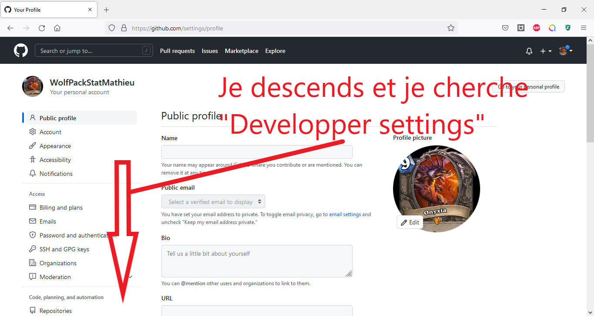
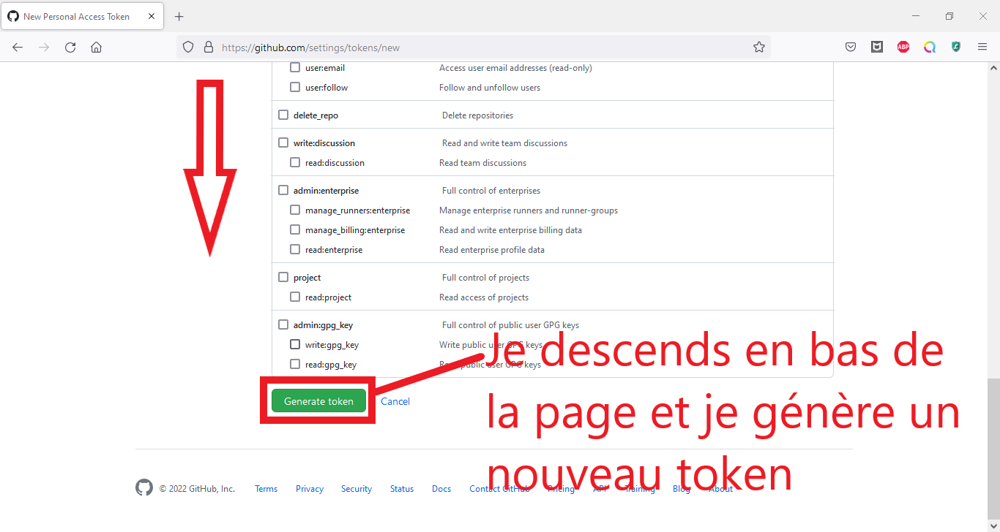
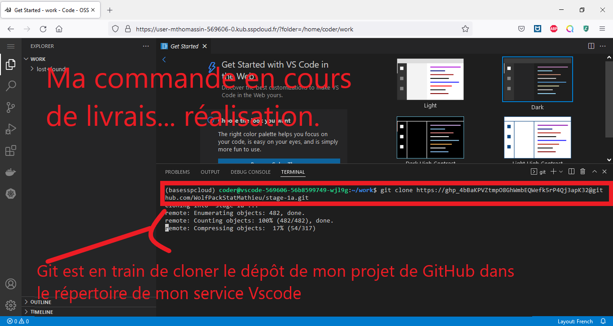

# Tuto : Utiliser un service Vscode sur le Datalab en sauvegardant son code sur Github

*Auteur: Mathieu Tomassin*

# Sommaire

- [Je lance un service Vscode](#je-lance-un-service-vscode)
- [Je clone mon projet github sur mon Vscode](#je-clone-mon-projet-github-sur-mon-vscode)
- [Je clone mon projet sur Vscode avec un token personnel](#je-clone-mon-projet-sur-vscode-avec-un-token-personnel)
- [Je relance un Vscode, mais avec ma configuration git personnelle](#je-relance-un-vscode-mais-avec-ma-configuration-git-personnelle)
- [Je m'entraîne à manipuler Git avec un super tuto déjà existant](#je-mentraîne-à-manipuler-git-avec-un-super-tuto-déjà-existant)
- [Je ferme mes services inutilisés sur le Datalab quand j'ai fini de travailler](#je-ferme-mes-services-inutilisés-sur-le-datalab-quand-jai-fini-de-travailler)

## Je lance un service Vscode

### Je me rends sur le Datalab => https://datalab.sspcloud.fr/home et j'arrive sur cette page :


Je sélectionne "Catalogue de services" et je cherche Vscode :


### Je lance un VsCode


Et voilà le travail  ! Un beau Vscode tout neuf (avec python). 


Mais, Onyxia fonctionne avec la technologie des conteneurs, ce qui pour nous signifie que le code sera supprimé à l'extinction du service. Nous allons donc appliquer une bonne pratique de développement : **découpler le code de l'environnement d'exécution** en utilisant le **contrôle de version**. Et pour cela, nous allons utiliser **Git** et **GitHub**. 

## Je clone mon projet github sur mon Vscode

### Je me rends sur mon compte Github

=> https://github.com/


### Je crée un nouveau repository 


Je donne un nom à mon dépôt, par exemple "depot_de_toto"


Pour le moment, je ne modifie pas les options, et je déroule la page pour cliquer sur "create repository".


Voilà, j'ai un beau repository tout neuf sur mon compte GitHub. Mais moi, je veux pouvoir travailler dessus à partir de Vscode.

Pour pouvoir faire ça, je vais cloner ce dépôt sur le service que je viens de créer, puis je synchroniserai les modifications du code entre ce service et mon dépôt GitHub.


## Je clone mon projet sur Vscode avec un token personnel 


### Je génère un token (="jeton mot de passe") qui me permettra d'accéder à mon compte GitHub depuis un terminal :





J'entre mon mot de passe :





Je vais dans Vscode, et j'ouvre un terminal.


En une ligne de code, je clone mon projet Git tout en m'authentifiant grâce à mon token. J'ai donc besoin:

- de l'url de mon projet `https://github.com/Mon_Nom_Utilisateur/Nom_du_depot.git`
- de mon token `mon_token` 

Rappel pour l'url :


Je surfe sur l'Internet pour retrouver la syntaxe d'un clonage avec token. :surfer:

Et je construis ma commande Git comme me l'indique le premier résultat sur **stackoverflow.com** : Je n'oublie pas l'arobase **@** ni le **.git** et encore moins le **git clone**. :stuck_out_tongue:

```
git clone https://oauth-key-goes-here@github.com/username/repo.git 
```



Je suis donc maintenant content, j'ai accès à mon dépôt Git et à un éditeur de code disposant de Python 3.10 (au jour où ce tuto est écrit). Le matériel qui supporte tout ceci est hébergé à l'Insee, et utilise les technologies de conteneurs (Docker) et d'orchestrateur de conteneurs (Kubernetes). **J'ai donc largement de quoi faire mes TP/projets en 1A.** 

**A noter** : Cette manière de faire depuis un terminal dans le service Vscode est sécurisée, car le token (c'est-à-dire mon identité) n'est pas stocké dans le Datalab. 
> S'ils stockent leur token sur Onyxia, j'y ai accès. C'est pour ça que je ne stocke jamais mon token GitHub, et j'utilise la connexion dans le terminal même s'il faut que je tape la commande.
>
> -- <cite>Le créateur de la plateforme Onyxia</cite>

Nous allons voir une façon plus "confortable" mais qui demande de stocker le token. 
# Je relance un Vscode, mais avec ma configuration git personnelle
Tout ceci était extrêmement sympathique, mais voyons comment éviter de faire toute la manoeuvre dans le terminal du service Vscode en le préconfigurant.

Je repars dans le Datalab et **je crée un nouveau service Vscode en modifiant la configuration**.


Il me suffit de remplir **correctement**  :grin: les champs de configurations. Attention au nom du dépôt Git : il prend le lien utilisé pour cloner (cf. plus haut dans le tuto).


Bon à savoir : Il est possible de stocker de façon permanente ses informations de connexion à GitHub dans Mon compte > Services externes. Mais, comme dit auparavant, ce n'est pas une bonne pratique.

# Je m'entraîne à manipuler Git avec un super tuto déjà existant

Les deux premiers liens pour ceux qui veulent mettre la main à la pâte:
[une présentation Git](https://hackmd.io/AOSXJAJiR4q7GKdbiKcKsw)
et le [tuto](https://hackmd.io/BdGZF6qOTk2qvzAlvrz_WA) qui va avec. Pour ces tutos, il faudra créer un compte sur Gitlab $\neq$ Github. Mais les deux permettent d'utiliser Git. Il faudra donc modifier vos paramètres d'utilisateurs. L'objectif est de maîtriser les 5 commandes principales (utilisation individuelle) et de savoir gérer les conflits (travail en groupe).
Une [autre présentation Git](https://ensae-reproductibilite.netlify.app/git/), un peu plus détaillée, qui est une partie d'un cours à l'Ensae (:revolving_hearts:) sur les bonnes pratiques de développement. 

# Je ferme mes services inutilisés sur le Datalab quand j'ai fini de travailler


